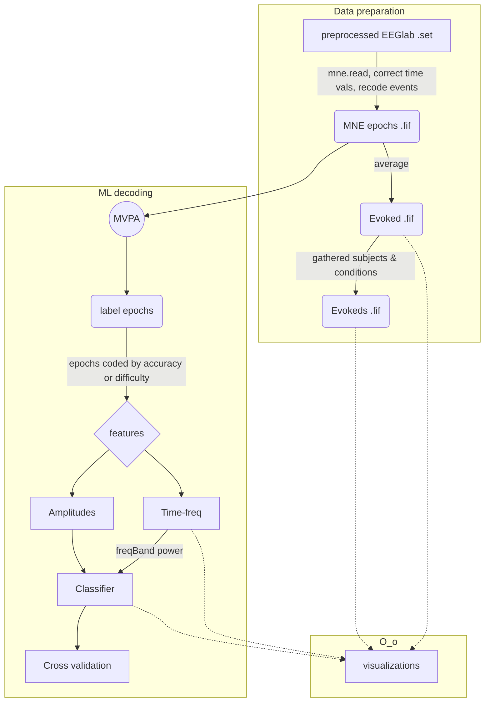
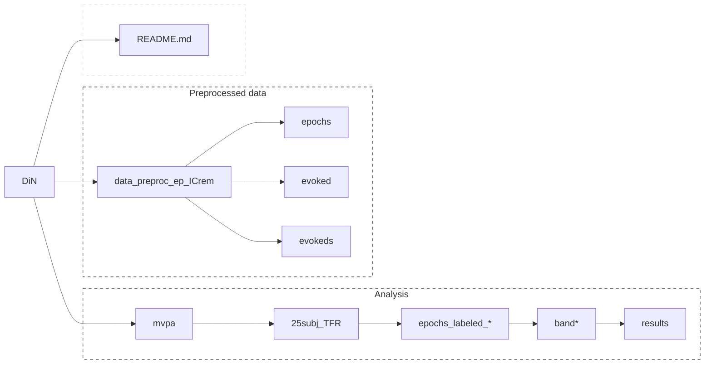

   

# Digits in Noise (DiN)
Data from Thomas Houweling study (digits in noise)

 Data and script FOLDERS 
 

## Data folders
All Digits-in-noise (DiN) EEG data are to be found under ‘EEG_DATA’ folder under the subject’s main folder (which also contains behavioral performance among others)

* In EEG_DATA the ‘.raw’ files are the raw recordings (4-6 files containing several tasks). Then, raw are saved into multiple .mat files (with parts)
* InterpChans.mat file contains info about channels interpolated for later steps
* In ‘EEG_DATA/Downsampled’ the .raw files are transformed into ‘.set’ files (different parts). It follows the main preprocessing pipeline, used in the submitted manuscript. \[‘Downsamp’ contains changes in revision. Do not use.]
 * ‘EEG_DATA/Downsampled/DiN’ contains epoched sets, and epoched_ICrem sets (after removal of IC components) as well as a trialInfo.mat file

## Scripts info
* Preprocessing scripts. Each script is a ‘part’ in the preprocessing sequence (parts 1-3) with multiple steps. 
* ‘Utils’ contains all required functions for theT.Houweling Data 
* ‘BAK’ contains unorganized copies of files. Ignore.

Visualizations filenames 
 

## Visualizations
The following plots summarize data\[by G.FragaGonzalez] 
SubjectID is used as preffix. When not specified in filename the file contains separate plots for correct and incorrect responses.s\* = subject id
| Filename     | content          
| ------------- |:-------------|
|Time_ERP_img_.*._s* | Time-domain. ERP image (y axis = trials, mean all channels, x= time,color map = amplitude). Per difficulty, accuracy. 
|Time_ERP_GFG_s* | Time-domain ERP butterfly plots (channels as colored lines). Includes GFP
|Time_ERP_topopost/topoprestim| topographical maps of activity in several time points before or after the stimli
|Freq_PSD_spec_s* | power spectral densitiy. Spectra plots for average of all channels (x axis = frequency)
|Freq_PSD_topo_s* | Topography of power for the 5 frequeny bands.

Event Fields and Triggers 
 

   
## Events
### Event fields (epoched data)

| Field id     | content          
| ------------- |:-------------|
|EEG.epochs.accuracy | indicates performance in identifying the digit presented 
| EEG.epochs.clarityOrig | subjective rating of how hard the trial was (by participant)
|EEG.epochs.clarityBin| clarityOrig transformed to thirds
|EEG.epochs.degLvlOrig | degradation of stimuli (SNR of presentation, which depended of degradation task) if 'none' it means there was no noise added. 
|EEG.epochs.degBin | transformation of degradation scores to more objective values. Values are 'none'= clear, 1='easy', 2= 'medium' SRT 50% correct in calibration. 3='difficult' 

### Triggers
>**`WARNING!`** In the EEGlab datasets, the variable EEG.actualTimes should be taken. The data are epoched to the DI24 marker indicating sound offset when using EEG.times as the time variable. When using EEG.actualTimes your 0 time will indicate the digit onset (note that in the experiment the trials have noise for > 4 secs and then the digits embedded in noise, and then the sound stops and participant can respond). 

Triggers: 'DIN2' = block start; 'DI28' = block end ;  'DIN6' = stim onset digit 0; 'DIN8' = stim onset digit 1;  'DI10' = stim onset digit 2 ; 'DI12' = stim onset digit 3 ; 'DI14' = stim onset digit 4; 'DI16' = stim onset digit 5; 'DI18' = stim onset digit 6;  'DI20' = stim onset digit 8; 'DI22' = stim onset digit 9;  'DI24' = comprehension response onset-cue / sound offset ; 'DI26' = clarity response onset

*Note*: in one of the preprocessing scripts there was some correction of triggers due to issues (splitted triggers) with EGI system. 

## Preprocessing 
Pipeline implemented in the data within the 'Downsampled' folder (eeg data storage) 
### segment01
\[DiN_pt01_preprocess_segment01.m]
  1. Import data (raw)
  2. Add channel locations and measurement unit
  3. Downsample (from 2kHz to 200Hz)
  4. Filter (highpass: 0.1Hz, lowpass: 48Hz)
  5. Remove line noise
  6. Remove bad channels & data segments (includes ASR corrections https://github.com/sccn/clean_rawdata/blob/master/clean_artifacts.m)
  7. Interpolate the removed channels
  8. Re-reference to average

### segment02
\[DiN_pt01_preprocess_segment02.m]

This script merges .set files resulting in one dataset per subject
  
### segment03
\[DiN_pt01_preprocess_segment03.m]
  
  9.  Checks data consistency
  10. Epoch
  11. Reject noisy epochs
  12. Remove trials with no responses
  13. Runs ICA and rejects non-brain components
   

## Multivariate pattern analysis 

 Machine learning decoding

## MVPA folder

